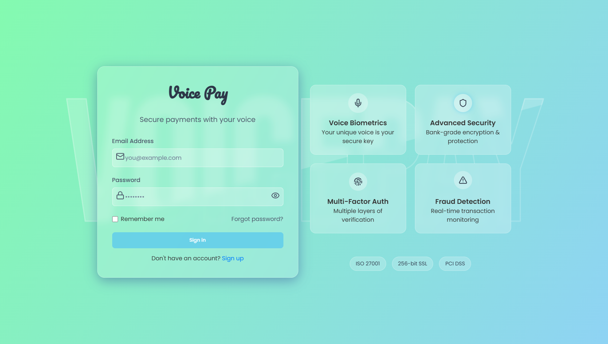
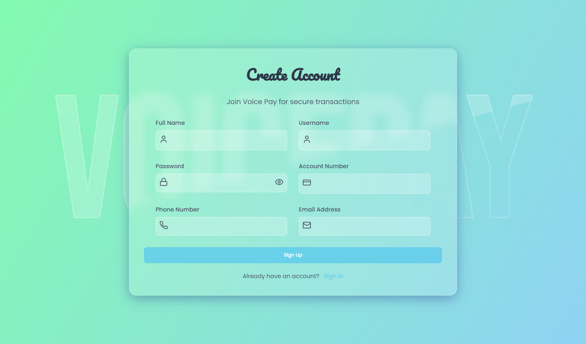
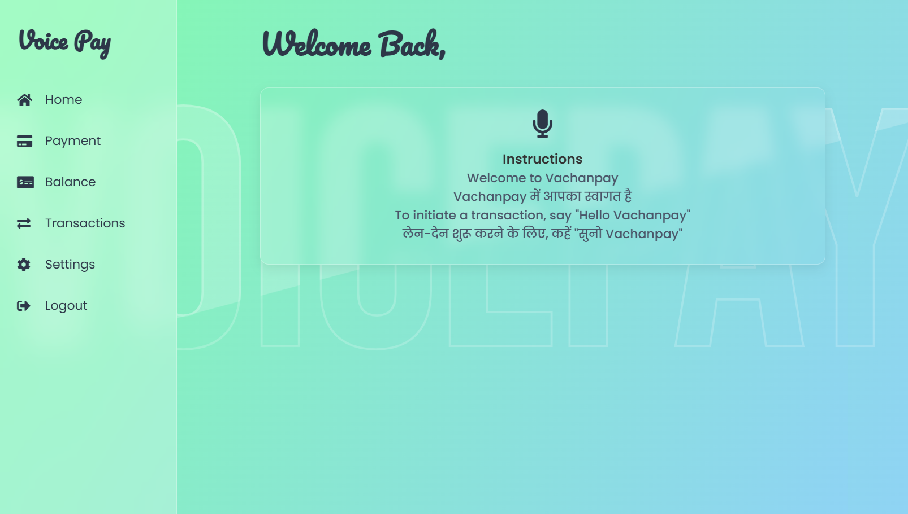
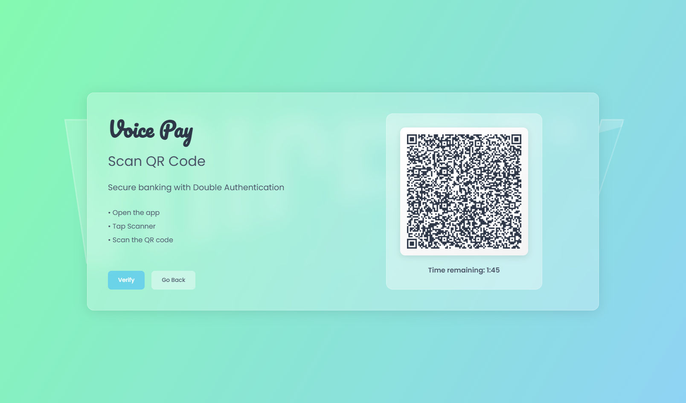

# 💳 Voice-Pay

> **A Voice-Enabled Digital Payment Application**

<div align="center">


**Voice-Pay** is an innovative digital payment application that leverages **voice recognition** and **speech synthesis** to enable accessible, hands-free payment transactions. Built with modern web technologies, it provides a seamless, user-friendly experience for secure money transfers.

[Demo](#) • [Documentation](#-features) • [Contributing](#-contributing)

</div>

---

## 🎯 Overview

Voice-Pay revolutionizes digital payments by introducing voice-enabled transactions. Whether you want to send money to a contact or check your balance, simply speak your request and let the AI handle it. The application supports multiple languages (English & Hindi) and provides real-time feedback through speech synthesis.

### ✨ Key Highlights

- 🎤 **Voice-Activated Payments** - Make payments using natural voice commands
- 🌐 **Multi-Language Support** - English & Hindi voice recognition and synthesis
- 🔐 **Secure Transactions** - QR code-based verification for secure payments
- 💰 **Transaction History** - Track all your payment history in one place
- ⚙️ **User Settings** - Customize your preferences and account details
- 📱 **Responsive Design** - Works seamlessly on all devices
- 🎨 **Smooth Animations** - Beautiful UI with Framer Motion transitions
- ⚡ **Fast & Lightweight** - Built with Vite for optimal performance

---

## 🚀 Quick Start

### Prerequisites

- **Node.js** 16+ ([Download](https://nodejs.org/))
- **npm** or **yarn** package manager
- Modern web browser with Web Speech API support

### Installation

```bash
# Clone the repository
git clone https://github.com/lakraanshul/Voice-Pay.git
cd Voice-Pay

# Install dependencies
npm install

# Start the development server
npm run dev
```

The application will open at `http://localhost:5173`

### Build for Production

```bash
# Build the application
npm run build

# Preview production build
npm run preview
```

---

## 📁 Project Structure

```
Voice-Pay/
├── src/
│   ├── components/
│   │   └── Sidebar.jsx          # Navigation sidebar
│   ├── pages/
│   │   ├── Home.jsx             # Voice command hub
│   │   ├── Payment.jsx          # Payment processing
│   │   ├── Transactions.jsx      # Transaction history
│   │   ├── Qr.jsx               # QR code verification
│   │   ├── Settings.jsx         # User preferences
│   │   ├── Login.jsx            # Authentication
│   │   ├── Signup.jsx           # User registration
│   │   ├── Logout.jsx           # Sign out
│   │   ├── Transaction.jsx      # Balance & details
│   │   ├── ErrorBoundary.jsx    # Error handling
│   │   └── ConfirmationWaiting.jsx # QR verification wait
│   ├── AnimatedRoutes.jsx        # Route animations
│   ├── App.jsx                   # Main application
│   ├── main.jsx                  # React entry point
│   ├── index.css                 # Global styles
│   └── App.css                   # App styles
├── package.json
├── vite.config.js
├── eslint.config.js
└── README.md
```

---

## 📸 Screenshots

<div align="center">

### 🔐 Login Page


### 📝 Signup Page


### 🏠 Home Dashboard


### 📱 QR Code Verification


</div>

---

## 🎨 Features in Detail

### 🎤 Voice Recognition & Commands

The application uses the **Web Speech API** to recognize voice commands:

| Command | Language | Action |
|---------|----------|--------|
| "Hello Voice Pay" | English | Initiate payment mode |
| "Suno Voice Pay" | Hindi | Initiate payment mode in Hindi |
| Voice Input | Both | Specify recipient & amount |

### 💳 Payment Processing

- **Smart Recipient Search** - AI-powered name suggestions as you speak
- **Amount Verification** - Clear confirmation before processing
- **QR Code Verification** - Secure two-factor authentication via QR codes
- **Instant Confirmation** - Real-time transaction status

### 📊 Transaction Management

- View complete transaction history
- Filter and search transactions
- Detailed transaction information
- Export transaction records

### 🔐 Authentication & Security

- User Login & Registration
- Secure session management
- LocalStorage-based authentication state
- Settings management

---

## 🛠️ Tech Stack

### Frontend
- **React 19** - UI framework
- **Vite 6** - Next-gen build tool with HMR
- **React Router 7** - Client-side routing
- **Framer Motion 12** - Animation library

### Libraries & Tools
- **Axios** - HTTP client for API calls
- **qrcode.react** - QR code generation
- **lucide-react** - Icon library
- **react-icons** - Additional icon set
- **react-speech-recognition** - Speech recognition wrapper
- **Nodemailer** - Email notifications
- **dotenv** - Environment variables

### Development
- **ESLint** - Code quality & linting
- **Babel** - JavaScript transpilation (via @vitejs/plugin-react)

---

## 📋 Available Scripts

```bash
# Development server with Hot Module Replacement
npm run dev

# Build for production
npm run build

# Preview production build locally
npm run preview

# Run ESLint for code quality checks
npm run lint
```

---

## 🎯 Use Cases

### 👤 Personal Transfers
Send money to friends and family using voice commands

### 💼 Small Business Payments
Quick payments to suppliers and contractors

### ♿ Accessibility
Hands-free payment option for users with mobility challenges

### 🌍 Financial Inclusion
Multi-language support makes payments accessible to diverse users

---

## 🌟 Core Pages Explained

| Page | Purpose | Key Features |
|------|---------|--------------|
| **Home** | Voice command hub | Speech recognition, AI processing, language selection |
| **Payment** | Process payments | Recipient search, amount entry, confirmation |
| **Transactions** | View history | Transaction list, filters, status tracking |
| **QR** | Verify payments | QR code display, timer-based verification, 2FA |
| **Settings** | User preferences | Account customization, preferences |
| **Login** | Authentication | User login, session management |
| **Signup** | Registration | New user registration |

---

## 🔌 API Integration

The application connects to a backend API (running on `localhost:3001`) for:

- User authentication
- Payment processing
- Transaction retrieval
- User search & suggestions
- QR code verification

### Key Endpoints
```
GET  /api/transactions          # Fetch all transactions
GET  /search-users?name=        # Search users by name
POST /payment                   # Process payment
POST /verify-qr                 # Verify QR code
```

---

## 🎨 Styling & UI

- **Modern CSS** with component-based styling
- **Responsive Design** - Mobile, tablet, and desktop compatible
- **Smooth Animations** - Framer Motion for polished transitions
- **Consistent Color Scheme** - Professional appearance
- **Accessibility Focus** - Keyboard navigation support

---

## 🤝 Contributing

Contributions are welcome! Please follow these steps:

1. Fork the repository
2. Create a feature branch (`git checkout -b feature/AmazingFeature`)
3. Commit your changes (`git commit -m 'Add AmazingFeature'`)
4. Push to the branch (`git push origin feature/AmazingFeature`)
5. Open a Pull Request

### Development Guidelines
- Follow ESLint rules
- Write clean, readable code
- Add comments for complex logic
- Test before submitting PR

---

## 📝 License

This project is licensed under the MIT License - see the LICENSE file for details.

---

## 👨‍💻 Author

**Anshul Lakra**

- GitHub: [@lakraanshul](https://github.com/lakraanshul)
- Live Demo: [Voice-Pay](https://lakraanshul.github.io/Voice-Pay)

---

## 🙏 Acknowledgments

- **React** team for the amazing framework
- **Vite** for lightning-fast builds
- **Framer Motion** for beautiful animations
- **Web Speech API** for voice recognition capabilities
- All contributors and users for their support

---

## ⚠️ Browser Compatibility

| Browser | Status | Notes |
|---------|--------|-------|
| Chrome | ✅ Full Support | Recommended |
| Edge | ✅ Full Support | Recommended |
| Firefox | ⚠️ Partial | Limited speech recognition |
| Safari | ⚠️ Partial | iOS limitations |

> **Note**: Voice features require modern browsers with Web Speech API support.

---

## 🐛 Issues & Support

Found a bug? Have a feature request? Please [open an issue](https://github.com/lakraanshul/Voice-Pay/issues) on GitHub.

---

<div align="center">

**Made with ❤️ for accessible digital payments**

⭐ If you find this project helpful, please consider giving it a star!

</div>
